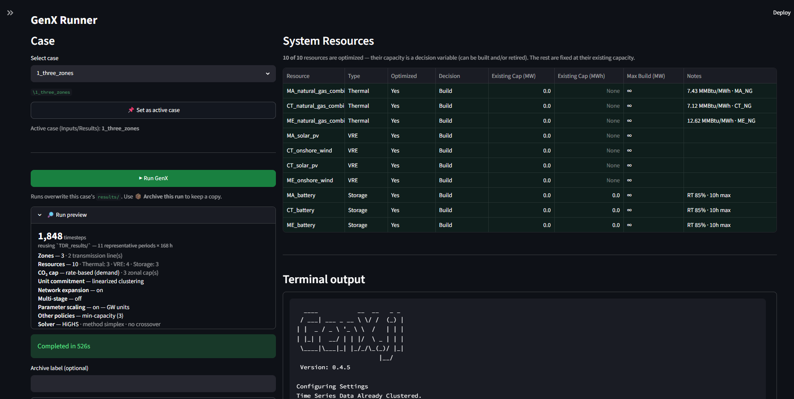
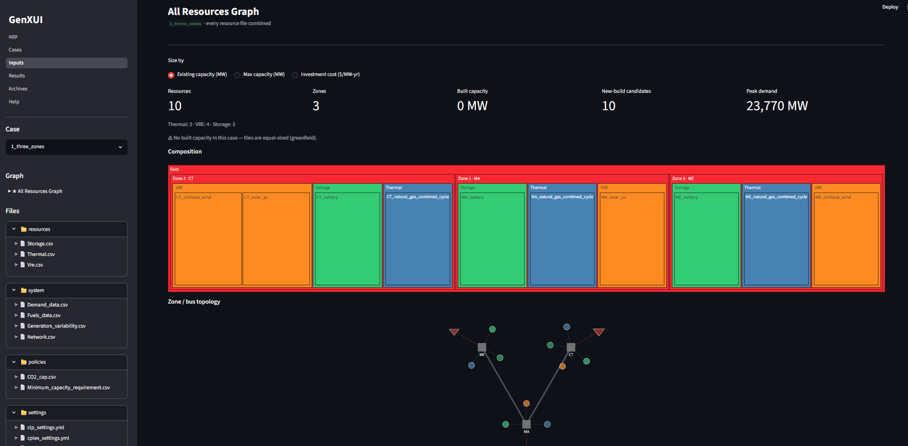
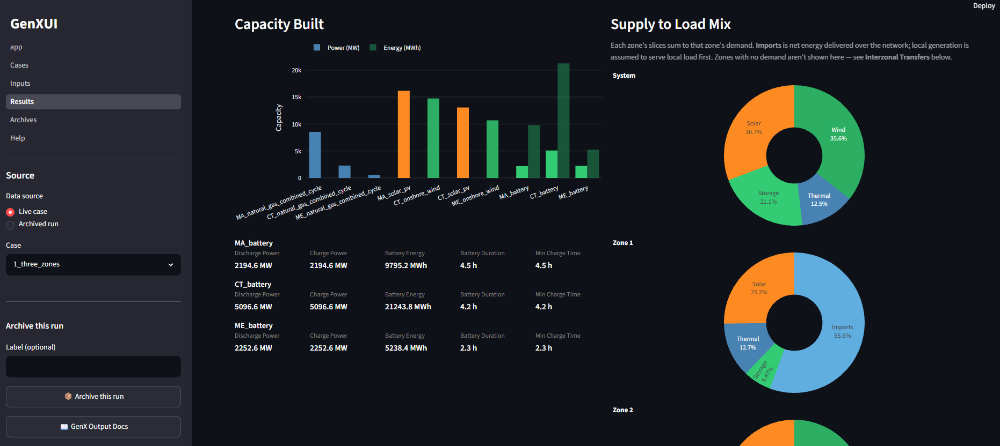

# GenXUI

A lightweight [Streamlit](https://streamlit.io/) interface for setting up, running, and exploring
[GenX.jl](https://github.com/GenXProject/GenX.jl) capacity-expansion models — so you can stop
hand-editing the CSVs that GenX reads and produces.

Started as a single-zone learning tool. It now handles the standard GenX example
systems, including multi-zone / DC-OPF networks, and reads GenX output directly
(no Julia re-run to look at results).

---

## Pages

| Page | What it does |
|---|---|
| **Runner** (`app.py`) | Pick a case, see a **Run Preview** of what the solve will contain (timesteps, zones, resources, policies, solver), and a **System Resources** table showing which capacities are optimized vs. fixed. Launch Julia and stream the terminal output live; a failed run gets a plain-language **diagnosis** instead of a wall of stack trace. Keep a copy of any run with **Archive this run**. |
| **Cases** | Create a case from a bundled GenX.jl example (the new case defaults to the example's name), or **rename / duplicate / delete** your own. Each card shows size and whether results are stale relative to inputs. |
| **Inputs** | Browse `resources/` · `system/` · `policies/` · `settings/` in a file tree. Edit CSV tables and `.yml` settings inline with save, each with a **Column / Settings reference** pulled from the GenX docs. An **All Resources Graph** view draws the fleet as a zone → type → resource treemap and a bus/tie-line topology diagram. |
| **Results** | Reads the GenX output CSVs and renders: zone-aware **Key Metrics** and per-asset **Energy** / **LCOE & cost** tables, **Capacity Built**, **Supply to Load Mix** (per-zone donuts that reconcile to each zone's demand, with an *Imports* slice), **Interzonal Transfers** (net import/export per zone, line flows vs. rating), **Unserved Energy** timing, **Cost Breakdown**, hourly curtailment / power, and an inferred **Storage Charging Source**. Exports a standalone HTML report. |
| **Archives** | Browse saved runs with headline metrics (system cost, NSE, capacity) and the GenX commit they ran against; open any archive in Results. |
| **Help** | Searchable GenX.jl reference (settings, inputs, outputs, time-domain reduction, solvers). Same content that backs the inline tooltips on the Inputs page. |

---

## Screenshots

**Runner** — run preview + optimize-vs-fixed resource summary


**Cases** — create from an example, rename / duplicate / delete


**Inputs** — inline CSV editing


**Inputs** — All Resources Graph (fleet composition + zone topology)


**Results** — capacity, per-zone supply mix


---

## Prerequisites

### 1. Julia + GenX

Install Julia ≥ 1.9 from [julialang.org](https://julialang.org/downloads/) and make sure it is on
your `PATH` (the Runner shells out to `julia`):

```bash
julia --version
```

Install GenX into your default Julia environment:

```bash
julia -e 'using Pkg; Pkg.add("GenX")'
julia -e 'using Pkg; Pkg.status()'   # should list GenX
```

The Runner executes each case with `julia --project=. Run.jl` from inside the case folder, so
`using GenX` has to resolve from that environment. (Alternatively, give a case its own
`Project.toml` that depends on GenX.)

### 2. A GenX.jl checkout *(recommended)*

Clone GenX next to this repo:

```
parent/
├── GenX.jl/     # git clone https://github.com/GenXProject/GenX.jl.git
└── GenXUI/      # this repo
```

GenXUI uses the sibling `../GenX.jl/` for two things: the bundled **example systems** the Cases
page imports from, and a *live* copy of the GenX docs for the Help page. Neither is required to
run your own cases — a docs snapshot ships in `reference/genx/` — but the example importer is
empty without it.

### 3. Python

Python ≥ 3.10. Install dependencies:

```bash
pip install -r requirements.txt
```

---

## Running the app

From the `GenXUI/` directory:

```bash
python -m streamlit run app.py
```

Then open <http://localhost:8501>.

---

## Workspace

On first launch GenXUI asks for a **workspace folder**. It creates two directories inside it:

```
<workspace>/
├── data/        active cases (inputs + their latest results/)
└── archive/     saved run snapshots
```

The choice is remembered in `~/.genxui/config.json` and can be changed any time from the
sidebar. GenXUI never scans arbitrary folders for cases — only `data/`.

### Adding cases

- **From an example** — Cases page → *New case from a GenX.jl example* → pick one → Create.
  It's copied into `data/` under the name you choose (defaults to the example name).
- **Your own** — drop a case folder into `<workspace>/data/`. A folder counts as a case if it
  contains a `Run.jl`. Standard GenX layout:

  ```
  MyCase/
  ├── Run.jl
  ├── resources/     Thermal.csv, Vre.csv, Storage.csv, Vre_stor.csv, …
  ├── system/        Demand_data.csv, Generators_variability.csv, Fuels_data.csv, Network.csv
  ├── policies/      CO2_cap.csv, …
  └── settings/      genx_settings.yml
  ```

See the [GenX input-file docs](https://genxproject.github.io/GenX.jl/stable/User_Guide/model_input/)
for the full spec.

### Runs and results

GenXUI-launched runs set `OverwriteResults: 1` so each run replaces the case's `results/` in
place (no `results_1/`, `results_2/`, … fan-out). To keep a run, use **Archive this run** on the
Runner or Results page — it snapshots `inputs + results` into `archive/` with headline metrics
and the GenX git commit.

---

## Limitations

- One case at a time — no side-by-side case comparison.
- Multi-zone / transmission runs are supported for viewing and analysis; the network-flow
  attribution in *Supply to Load Mix* is a documented approximation (local generation assumed to
  serve local load first).
- No multi-stage (`MultiStage`) investment support.
- Julia startup latency (~30–90 s) before the first solver output appears.

---

## Development

```bash
pip install pytest ruff
python -m pytest tests/         # pure-logic tests (no Julia, no Streamlit)
python -m ruff check src/ pages/
```

Repo layout: `app.py` + `pages/` are the Streamlit UI; `src/` holds the pure logic
(`workspace`, `metrics`, `run_preview`, `run_diagnosis`, `help_docs`, `fleet_view`, …);
`reference/genx/` is a bundled GenX docs snapshot for the Help page; `ops/` holds the
build-process harness.

---

## Attribution

Developed by **Alex Panchula** with [Claude Code](https://claude.ai/code) (Anthropic).

GenX is developed and maintained by the [GenX Project](https://github.com/GenXProject/GenX.jl) team.
